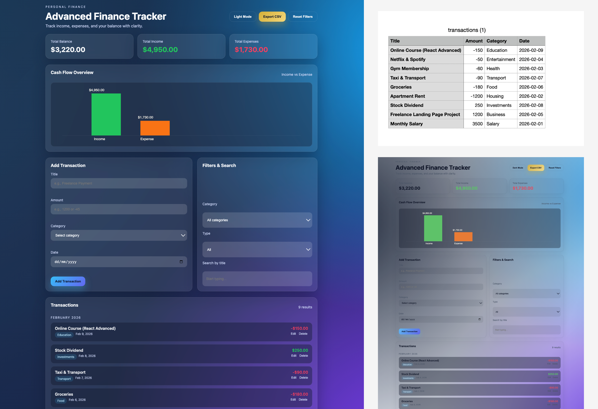

# Advanced Finance Tracker

A portfolio-level personal finance management application built with HTML, CSS, and Vanilla JavaScript.  
This project was intentionally developed without frameworks or third-party libraries to demonstrate a strong understanding of core front-end fundamentals and application architecture.

Live Demo:  
https://amirhosseinln.github.io/advanced-finance-tracker/

---

## CPT304 Coursework Enhancement

This copy includes accessibility fixes, a two-language toggle, a cookie banner,
`privacy.html`, a tested `finance-core.js` module, and a GitHub Actions coverage
workflow.

Useful commands:

```bash
npm test
npm run coverage
npm run coverage:lcov
```

Before coursework submission, replace the placeholders in `github-url.txt` and
`live-url.txt`, fill `individual-contribution.xlsx`, deploy the app, and convert
`report-draft.md` to `report.pdf` after adding real screenshots.

---

## Preview

<p align="center">
  
</p>

---

## Overview

The Advanced Finance Tracker is a structured, state-driven front-end application designed to simulate a production-style user experience.

Rather than focusing solely on UI, the primary goal was to implement:

- Predictable state management  
- Clear separation between logic and rendering  
- Functional, modular code organization  
- Real-world UX behaviors (validation, confirmations, feedback, persistence)  

The application demonstrates how a maintainable front-end system can be built using only native browser APIs.

---

## Core Functionality

### Transaction Management

- Add, edit, and delete transactions using unique identifiers  
- Inline validation with clear user feedback  
- Delete confirmation modal to prevent accidental actions  

### Dashboard & Data Visualization

- Real-time summary of total balance, income, and expenses  
- Monthly grouping of transactions  
- Income vs Expense bar chart implemented using the Canvas API (no chart libraries)  

### Filtering & Search

- Filter by category  
- Filter by transaction type (income / expense)  
- Live search by title  
- Reset controls for quick state clearing  

### Data Persistence

- Automatic save to LocalStorage  
- Automatic restoration on page refresh  
- Dark / Light mode preference persisted between sessions  

### Export Capability

- Export transaction data to CSV format  

### User Experience

- Toast notifications for feedback  
- Professional empty state with call-to-action  
- Responsive layout with modern card-based UI  
- Clean spacing, color hierarchy, and readable typography  

---

## Architecture & Design Approach

The application follows a functional architecture with a centralized state model.

### State Management

All application data is managed through a single state object.  
UI updates are driven by state changes, ensuring predictable rendering behavior.

### Separation of Concerns

- Business logic and rendering logic are separated  
- DOM references are centralized  
- Utility functions handle formatting and reusable behaviors  

### Rendering Strategy

The render cycle is triggered after state mutations, allowing the UI to stay in sync with data without unnecessary reflows or side effects.

### Code Organization Principles

- Minimal global scope pollution  
- Reusable, composable functions  
- Clear naming and structured responsibilities  
- No unnecessary abstractions  

This structure reflects patterns commonly used in small-to-medium scale front-end applications.

---

## Technology Stack

- HTML5  
- Modern CSS (custom properties, responsive layout, component-style structure)  
- Vanilla JavaScript (ES6+)  
- Canvas API  
- LocalStorage API  

No frameworks.  
No external libraries.  
No UI toolkits.  

---

## What This Project Demonstrates

- Strong command of core JavaScript fundamentals  
- Ability to build structured front-end systems without frameworks  
- Practical state management implementation  
- Manual data visualization using native APIs  
- Clean UI architecture and UX consideration  
- Production-oriented thinking in a standalone front-end application  

---

## Possible Extensions

- Category analytics dashboard  
- Monthly trend visualizations  
- Backend integration  
- Authentication and user accounts  
- Data import functionality  

---

## Author

Amirhossein Latifi Navid  
Front-End Developer
